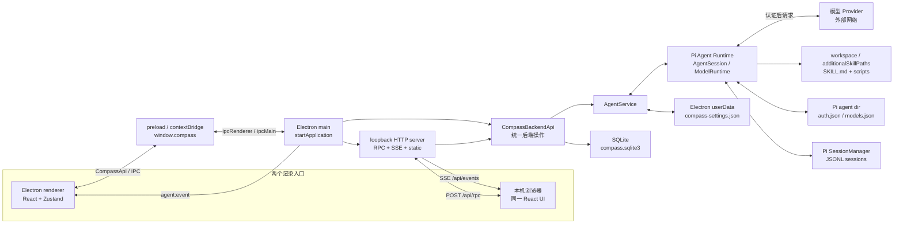
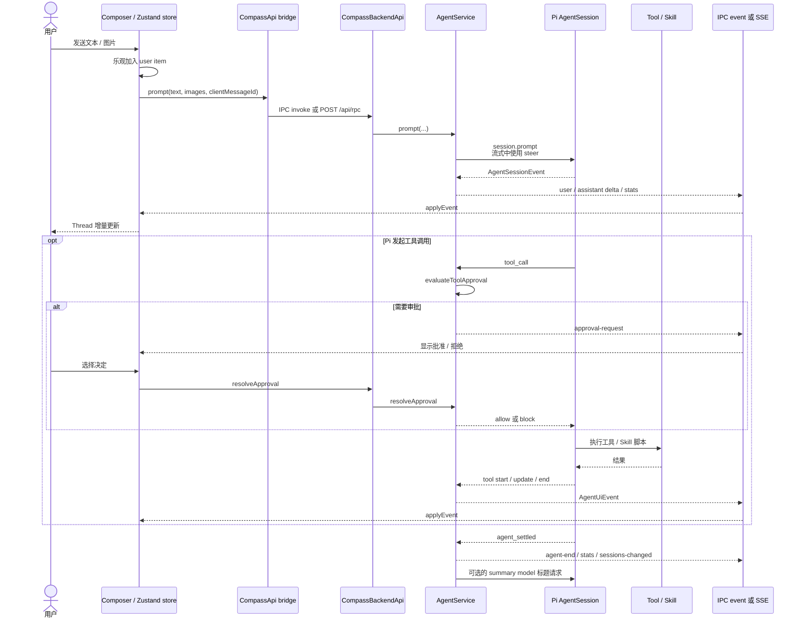

# FAI / Compass 项目上下文

> - **定位**：本文件是新会话的项目上下文入口和当前实现索引，不是宣传材料、需求承诺或安全认证。
> - **适用范围**：仓库根目录、`compass/` 应用、两个外部验配软件 Skill、调查资产、测试、CI 与宣传站点部署文件。
> - **最后核验日期**：2026-08-10
> - **核验基线**：本轮改动开始前的 `origin/main` 完整提交 `d498cc14e8ad3abdad33af7a823e792ba48a1eb5`
> - **维护责任**：凡修改架构、契约、持久化、命令、环境变量、语言、Provider、Skill、Pi pin、CI、部署或打包流程的提交，其作者与评审者应同步更新本文件并刷新核验 SHA。
> - **事实规则**：当前代码、[`compass/package.json`](compass/package.json)、锁文件、[`.gitmodules`](.gitmodules)、子模块 gitlink 和 [CI](.github/workflows/ci.yml) 优先；测试与脚本其次；技术文档再次；[`Compass提案.md`](Compass提案.md)、`Compass_intro*.html` 与部署页面只说明历史背景或产品愿景。冲突时以当前代码为准。

## 60 秒快速理解

**FAI 是仓库与集成工作区；仓库没有给出可证实的 FAI 全称。Compass 是其中真正运行的 Electron 应用。** 当前代码面向助听器验配人员：在一个本地桌面进程内运行 Pi Agent，会话可使用模型、工具和仓库中的验配软件自动化 Skill；React UI 同时可由 Electron 窗口和本机浏览器访问。客户档案在 SQLite，Agent 对话在 Pi JSONL，会话设置和认证分开保存。

当前已经实现：

- Electron main + preload + React renderer，并提供同一套 [`CompassApi`](compass/src/shared/types.ts) 给桌面 IPC 和本机 Web RPC；
- Pi Agent 会话、流式文本/思考/工具事件、图片附件、会话列表、自动标题、模型/Provider 认证、权限审批和 Skill 动态发现；
- Streamdown 流式 Markdown、按动画帧合并高频 delta，以及工具/思考/正文共享的单一活动 Orb；
- 客户档案、助听器品牌和“会话—客户”正式归属的 SQLite 持久化；
- Phonak Target 与 Widex COMPASS GPS 的 Windows UI 自动化 Skill；
- Git/Bash、验配软件和 Noahlink Wireless driver 的本机检测与安装进度；
- 简体中文、繁体中文、英语、德语，浅色/深色/跟随系统主题。

不要误解为已实现：

- `hearing-health` 目前只是占位页面，不是完整听力健康工作台；
- Agent 是辅助执行与记录机制，不替代临床判断，也不是自主诊断系统；
- Web 入口只监听 loopback，依赖正在运行的 Electron 主进程，不是云端、多用户或远程服务；
- `npm run build` 只生成 `compass/out/`，仓库没有已提交的、可复现的 Windows Setup 打包命令，也没有可验证的应用 R2 发布流程；
- “可解释、可确认、可执行、可验证、可记录”是产品方向。代码实现了对话、审批、工具事件和持久化等支撑，但不能据此宣称所有验配工作流已闭环。

新会话先做：

```powershell
git rev-parse --show-toplevel
git branch --show-current
git status --short
git submodule status -- compass/vendor/pi
```

保留已有 dirty/untracked 内容；不要直接编辑 `compass/vendor/pi`。开发命令均在 `compass/` 运行。推荐使用与 CI 相同的 Node 24；当前 Pi 至少要求 Node `>=22.19.0`。

```powershell
git submodule update --init --recursive
Set-Location compass
npm ci
npm run dev
```

主要本地验证：

```powershell
npm run typecheck
npm run test:unit
npm run audit:providers:static
npm run build
```

工作流内阻断的 `check` job 运行 `npm ci`、`typecheck`、全部 unit/behavior tests、静态 Provider audit 和 `build`；`smoke` job 会构建并驱动真实 Electron，当前同样是阻断检查。仓库 YAML 不能证明 GitHub 分支保护是否把这些 job 设为 required check。静态 Provider audit 不访问外部端点；默认 audit 会探测外部端点，`--live` 和 `strict-live` 会发真实模型请求并可能消耗额度，未经明确授权不要运行。

如果任务涉及 Setup：先报告“当前仓库没有可复现流程”，不要从本机临时文件或历史聊天发明命令。
如果任务涉及外部验配软件、live audit、发布/上传、合并或用户数据删除：先取得明确授权。

---

## 1. 如何阅读与判定事实

本文采用三种状态：

| 状态 | 含义 | 使用规则 |
| --- | --- | --- |
| **当前已实现** | 可由当前代码、锁文件、测试或 CI 直接证明 | 可以作为开发依据，但仍要在改动前重读相关入口 |
| **历史背景 / 产品愿景** | 只来自提案、介绍页或营销部署 | 可帮助理解方向，不得覆盖实现事实 |
| **待确认** | 仓库没有足够证据，或验证需要网络、真实账号、设备或发布系统 | 不猜测；需要时向维护者或真实环境求证 |

最容易误导新会话的边界：

1. 仓库名 FAI 不等于 Compass 可执行产品名；FAI 的缩写含义是**待确认**。
2. `Compass提案.md` 和 `Compass_intro*.html` 描述愿景；功能是否存在要回到 `compass/src/`。
3. 根目录 UIA JSON/TXT/PNG 与 `target-bottom-tabs/` 是调查证据，不会被应用自动加载。
4. `deploy/` 构建的是介绍站点，不是 Electron 应用。
5. `compass/vendor/pi` 是固定提交的 Git 子模块，不是 Compass 自有源码副本。

## 2. 产品、用户与边界

### 2.1 FAI 与 Compass

- **FAI**：当前仓库及其集成资产的工作区，包含 Compass 应用、外部软件自动化 Skill、宣传材料、UIA 调查快照和站点部署文件。当前源码没有给出可验证的全称、法律归属或许可证关系，因此不作推断。
- **Compass**：[`compass/`](compass/) 下的 Electron + TypeScript + React 本地应用。主进程托管 Pi Agent、数据库、设置、认证适配、依赖项管理和 loopback Web 服务；渲染层提供对话与管理 UI。

主要用户和场景来自当前 [`COMPASS_CONTEXT`](compass/src/main/compass-context.ts) 与 UI：助听器验配人员在客户语境中向 Agent 提问、选择模型、调用技能、审批工具操作、查看流式结果，并让 Skill 操作已安装的厂商验配软件。提案中“把听力数据和主观主诉转成可解释、可确认、可执行、可验证、可记录的建议”说明产品方向，但当前实现的可靠承诺只限于代码已有的数据、审批、事件和自动化链路。

### 2.2 当前能力与非目标

| 当前已实现 | 明确不是当前事实 |
| --- | --- |
| 单一主进程中的 Pi Agent 会话与模型调用 | 云端托管、多用户隔离、远程 Web 服务 |
| Electron 与浏览器共享同一后端状态和事件 | 两个独立 Agent 或跨机器同步 |
| 客户主档及会话归属的本地 SQLite | 医疗信息系统、完整病历或诊断数据库 |
| 工具审批与工作区路径判断 | 操作系统级沙箱或完备安全策略 |
| Phonak/Widex UI 自动化 Skill | 对所有厂商、版本、语言和屏幕布局的通用支持 |
| 构建到 `out/` | 官方 Windows Setup、签名、自动更新或已验证 R2 发布 |
| `hearing-health` 导航入口 | 已完成的听力健康业务功能 |

## 3. 仓库地图

| 路径 | 角色 | 是否运行时依赖 / 修改提示 |
| --- | --- | --- |
| [`compass/`](compass/) | Compass 产品源码、测试、脚本、技术文档及 Pi 子模块 | 产品核心；改动按契约运行相应验证 |
| [`phonak-target-control/`](phonak-target-control/) | Phonak Target Windows UI Automation Skill | Agent 可发现的 Skill；能操作真实外部软件和客户数据，遵守其 `SKILL.md` 安全契约 |
| [`widex-compass-gps-control/`](widex-compass-gps-control/) | Widex COMPASS GPS Windows UI Automation Skill | 同上；连接设备和保存验配均要求明确确认与状态回读 |
| [`target-bottom-tabs/`](target-bottom-tabs/) | Target 底部页签的 UIA 摘要与文本调查结果 | 参考资产；当前产品源码无引用，不是运行时依赖 |
| [`deploy/`](deploy/) | 两个宣传站点的提取、静态 server、nginx 与 systemd 配置 | 只部署介绍页，不构建或发布 Compass 应用 |
| [`assets/`](assets/) | 介绍材料使用的品牌/媒体资产 | 宣传资产，不是 `compass/src/renderer` 的打包入口 |
| [`.github/`](.github/) | GitHub Actions CI | 当前合并检查事实来源 |
| [`Compass提案.md`](Compass提案.md) / `Compass提案.docx` | 历史产品提案 | 只用于愿景；不覆盖代码 |
| `Compass_intro*.html` | 自包含介绍/比赛页面源 | 大体量历史/营销材料；由 `deploy/*/build_site.py` 消费 |
| 根目录 `target-*.json`、`target-*.txt`、`target-*.png` | UIA 树、过滤结果、截图 | 调查快照，可能包含环境或界面信息；不要当主源码或复制隐私内容 |
| 根目录 UUID 命名 PNG | 介绍页媒体资产 | 非应用运行时依赖 |
| [`.github/workflows/ci.yml`](.github/workflows/ci.yml) | 当前 CI 定义 | 修改命令/Node/子模块流程时同步本文 |

`node_modules/`、`compass/out/`、`deploy/*/dist/`、`smoke-out/`、coverage 和临时截图属于生成/测试产物，受 [`.gitignore`](.gitignore) 管理；不要枚举、编辑或作为事实来源。

## 4. 总体架构



解释：

- [`startApplication`](compass/src/main/index.ts) 只创建一组 `AgentService`、`ClientDatabase`、`DependencyManager` 和 `CompassBackendApi`。Electron 窗口与浏览器不是两套后端。
- 桌面通过 [`compass/src/preload/index.ts`](compass/src/preload/index.ts) 的 `contextBridge` 使用 IPC；浏览器通过 [`createWebApi`](compass/src/renderer/src/web-api.ts) 使用 `/api/rpc`，二者都实现 [`CompassApi`](compass/src/shared/types.ts) 契约。
- 主进程的 `emitAgentEvent` 同时发送 Electron `agent:event` 和 Web server 订阅事件；Web 转为 SSE。桌面/Web 若同时打开，会看到同一活动会话的事件。
- 设置、客户数据库、Pi 认证与 Pi 会话是四个不同存储。不要把某一存储备份当作完整备份。

### 4.1 消息、工具与审批时序



关键边界：

- [`store.prompt`](compass/src/renderer/src/store.ts) 先乐观显示用户消息，RPC 失败时回滚；主进程用 `clientMessageId` 对齐随后到达的真实事件。
- 活动会话正在流式时，[`AgentService.prompt`](compass/src/main/agent.ts) 使用 Pi 的 `streamingBehavior: "steer"`，不是创建第二个会话。
- 工具执行事件由 [`AgentService.onSessionEvent`](compass/src/main/agent.ts) 投影成 [`AgentUiEvent`](compass/src/shared/types.ts)；[`Thread`](compass/src/renderer/src/components/Thread.tsx) 只展示投影结果。
- 自动标题在 `agent_settled` 后 best-effort 调用所选 summary model；这可能发出额外真实模型请求和产生费用。

## 5. 构建与启动生命周期

### 5.1 electron-vite 三个产物

[`electron.vite.config.ts`](compass/electron.vite.config.ts) 定义：

| 目标 | 入口约定 | 输出 | 说明 |
| --- | --- | --- | --- |
| main | Electron main | `out/main/`，ESM | 外部化依赖；托管 Agent、DB、IPC/Web |
| preload | Electron preload | `out/preload/`，CJS | `contextBridge.exposeInMainWorld("compass", api)` |
| renderer | React/Vite | `out/renderer/` | Electron 与浏览器复用同一 UI |

### 5.2 开发模式

`npm run dev` 由 `electron-vite dev` 启动：

1. Vite renderer 监听 `127.0.0.1:${COMPASS_WEB_PORT:-5173}`。
2. Electron main 看到 `ELECTRON_RENDERER_URL` 后，把 API server 放到 `127.0.0.1:${COMPASS_WEB_API_PORT:-4317}`。
3. Vite 把 `/api` 代理到 4317；[`ensureDevApiReady`](compass/electron.vite.config.ts) 最多等待 45 秒，避免旧浏览器标签在主 API 就绪前立即失败。
4. Electron 窗口加载 Vite URL；浏览器也访问同一 URL。

生产/preview 模式没有 Vite 代理：main 的 [`startCompassWebServer`](compass/src/main/web-server.ts) 在 `COMPASS_WEB_PORT`（默认 5173，主进程允许传 0 选取随机端口）同时服务 `out/renderer`、RPC 和 SSE；Electron 窗口加载该 server URL。

### 5.3 `startApplication` 连接顺序

[`compass/src/main/index.ts`](compass/src/main/index.ts) 的 `startApplication`：

1. 在 Electron ready 前应用 `COMPASS_USER_DATA_DIR`，然后确定 `COMPASS_DATABASE_PATH` 或 userData 下的数据库。
2. 创建 `ClientDatabase`、`AgentService`、`AuthLoginController` 和 `DependencyManager`。
3. [`createCompassBackendApi`](compass/src/main/compass-api.ts) 把它们组合为共享业务 API；[`registerIpc`](compass/src/main/index.ts) 只是桌面传输适配。
4. 启动 loopback Web server。开发时它只服务 API；preview 时还服务 renderer 静态文件。
5. 创建 `BrowserWindow` 并加载 renderer。
6. best-effort 启动 Pi 会话；失败会记录，但窗口创建流程不因此假装会话可用。

渲染端 [`ipc.ts`](compass/src/renderer/src/ipc.ts) 使用 `window.compass` 时是桌面；否则创建 Web API。桌面在 `boot()` 前即可订阅 `agent:event`；Web 为避免启动期间丢状态，先 `boot()`，再订阅由 [`web-agent-events.ts`](compass/src/renderer/src/web-agent-events.ts) 缓冲和重同步的 SSE 事件。

### 5.4 关闭

[`shutdown`](compass/src/main/index.ts) 会：

- 中止进行中的 Provider 登录；
- 取消依赖安装任务；
- 中止正在流式的 Agent，并取消待审批请求、释放 Pi session；
- 关闭 SSE 客户端和 Web server；
- 对文件数据库尝试 `wal_checkpoint(TRUNCATE)` 后关闭 SQLite。

不要用强杀进程替代正常退出，尤其在数据库写入、外部安装或 UI 自动化进行时。

## 6. 主进程职责与危险边界

| 模块 / symbol | 输入 → 输出 | 持久化或副作用 | 容易出错的边界 |
| --- | --- | --- | --- |
| [`AgentService`](compass/src/main/agent.ts) | 设置、客户注册表、Pi 事件 → `InitPayload`、线程、stats、`AgentUiEvent` | Pi JSONL、Compass settings、依赖可执行文件环境变量、真实模型请求 | 恢复旧会话时沿用会话模型；自动标题与审批说明会另发请求；审批结束会取消尚未完成的说明请求；切换工作区会创建新会话 |
| [`SessionManager.create/open`](compass/src/main/agent.ts) + [`session-library.ts`](compass/src/main/agent/session-library.ts) | workspace 或 session path → 活动 Pi session | JSONL append、rename/archive/delete | 打开、归档、删除都先按当前 workspace 已列出会话做 canonical allow-list 校验；活动会话移除先转移生命周期所有权，失败时恢复；成功后以内部 session ID 清理客户归属但不向 renderer 泄露该 ID |
| [`projectThread`](compass/src/main/thread-projector.ts) | Pi messages/tool results → `UiThreadItem[]` | 无独立存储 | UI thread 是投影，不是第二份会话数据库 |
| [`generateMissingSessionTitle`](compass/src/main/agent.ts) | 已完成线程 + summary model → session name | 写 Pi session info；网络/费用 | best-effort；失败不会阻断对话，不应假设每个会话都有标题 |
| [`normalizeImages`](compass/src/main/image-attachments.ts) | UI base64 图片 → Pi attachment | 请求体/内存、模型请求与 Pi session 内容 | 最多 8 张、单张 10 MiB、解码后总计 24 MiB；Web 的 26 MB JSON 上限会被 base64 膨胀提前触发 |
| [`startWindowsDictation`](compass/src/main/compass-api.ts) / [`focusWindowForDictation`](compass/src/main/dictation-window.ts) | 桌面请求 → Windows dictation | 聚焦窗口、触发系统输入 | 桌面专属；Web 使用浏览器 `SpeechRecognition`，不是同一实现 |
| [`permissionExtension`](compass/src/main/agent.ts) / [`evaluateToolApproval`](compass/src/main/permission-policy.ts) | Pi `tool_call` → allow/block/审批事件 | 可触发文件、shell、网络或外部工具 | 只是工具名、少量参数字段与正则策略，不是 OS 沙箱 |
| [`DependencyManager`](compass/src/main/dependency-manager.ts) + [`dependencies/`](compass/src/main/dependencies/) | inventory、catalog、用户安装/可执行文件选择 → snapshot/progress | 校验下载、受限解压、启动安装器或打开厂商官网、写 userData/Compass settings | 只有带精确字节数与 SHA-256 的 artifact 可自动下载；不可独立核验的厂商包显式为 external；取消只存在于可逆阶段，安装器/官网启动后属于不可逆外部阶段 |
| [`getRuntimePrerequisites`](compass/src/main/prerequisites.ts) | workspace/平台 → Git Bash 前置状态 | 检测进程；操作动作可启动 winget/网页 | 检测与安装是两步；Web 页面仍依赖桌面主进程执行 |
| [`ModelRuntime`](compass/vendor/pi/packages/coding-agent/src/core/model-runtime.ts) + [`AuthLoginController`](compass/src/main/auth-login-controller.ts) | Provider、key/OAuth → models/auth status | Pi auth 文件、浏览器登录、网络 | 已存凭据会“拥有”该 Provider；失败时不会静默退回环境变量 |
| [`loadSettings` / `saveSettings`](compass/src/main/settings.ts) + [`settings-persistence.ts`](compass/src/main/settings-persistence.ts) | JSON ↔ `AppSettings` | 同目录临时文件 flush/close 后原子替换 `compass-settings.json`；损坏 JSON 隔离为恢复证据 | 不存在的 workspace 回退默认；不存在的额外 Skill 目录会被过滤；写入、flush、close、replace、cleanup 的失败原因不会互相覆盖 |
| [`ClientDatabase`](compass/src/main/client-database.ts) | client/profile/assignment RPC → `ClientRegistry` | SQLite 事务/WAL | schema 迁移、隐私、备份时机；不要由 renderer 直接访问 DB |
| [`startCompassWebServer`](compass/src/main/web-server.ts) | loopback HTTP → static/RPC/SSE | 本机端口、长连接 | 无用户认证；安全依赖 loopback、Host/Origin 和本机信任 |

`CompassBackendApi` 是业务组合层；IPC 和 Web 只应做参数校验、传输和事件桥接。新增行为时避免在两个传输适配中复制业务逻辑。

会话 owner 由 [`LifecycleCoordinator`](compass/src/main/agent/lifecycle-coordinator.ts) 串行管理并采用 create-before-swap：候选创建失败时旧 session 保持可用，成功切换后才屏蔽旧回调并清理旧 owner。每个 owner 绑定独立 runtime settings；workspace、Skill 目录与禁用 Skill 先以 staged config 创建候选，候选 ready 后通过同步 `beforePublish` 在同一事件循环提交 settings 文件、发布内存设置并立即 swap owner，因此旧 Prompt/Approval 不会在候选期提前读到新 workspace。非模型设置通过 [`SettingsMutationTransaction`](compass/src/main/agent/settings-mutation-transaction.ts) 以字段级快照串行提交，统一协调内存、原子 settings 文件和 live-session/environment 副作用；任何阶段失败会补偿恢复，并保留主错误与所有补偿错误。

## 7. 渲染层、状态与双入口

### 7.1 页面与组件

[`App`](compass/src/renderer/src/App.tsx) 管理两种 `MainView`：

- `assistant`：空线程显示 [`Hero`](compass/src/renderer/src/components/Hero.tsx) 与 [`QuickPrompts`](compass/src/renderer/src/components/QuickPrompts.tsx)；有消息、审批或依赖提示时显示 [`Thread`](compass/src/renderer/src/components/Thread.tsx)；底部始终是 [`Composer`](compass/src/renderer/src/components/Composer.tsx)。
- `hearing-health`：显示 [`HearingHealthWorkspace`](compass/src/renderer/src/components/HearingHealthWorkspace.tsx)，当前为占位实现。

[`Sidebar`](compass/src/renderer/src/components/Sidebar.tsx) 负责新建/搜索会话、客户与日期归组、正式归属操作、重命名/归档/删除、主视图切换和本地操作员菜单。`Ctrl/Cmd+,` 打开设置，`Ctrl/Cmd+N` 新会话，`Ctrl/Cmd+K` 或 `Ctrl/Cmd+P` 打开会话搜索。宽度可拖动并写 localStorage；小于 760px 时变为遮罩式侧栏。

[`SettingsWorkspace`](compass/src/renderer/src/components/SettingsWorkspace.tsx) 的 `SettingsSection` 为：

`general`、`appearance`、`profile`、`models`、`skills`、`dependencies`。

其中包括界面语言、Command 说明语言、Quick Prompts、主题、操作员资料、Provider 认证、启用模型、标题 summary model、Skill 目录/开关、依赖项状态/安装。Command 说明语言默认跟随界面语言，也可独立指定为简体中文、繁体中文、英语或德语。工作区和权限模式都不在 Settings 页面：工作区从 [`Composer`](compass/src/renderer/src/components/Composer.tsx) 的 workspace 操作入口更换，权限模式由同一区域的 [`PermissionMenu`](compass/src/renderer/src/components/composer/PermissionMenu.tsx) 修改；两者都会持久化。

[`Thread`](compass/src/renderer/src/components/Thread.tsx) 使用 [`Streamdown`](compass/src/renderer/src/components/Markdown.tsx) 渲染 Markdown。只有最新的普通流式正文启用新词淡入，历史、Thinking、工具与 Skill 保持静态；reduced-motion 只关闭动画，不关闭不完整 Markdown 修复。[`agent-event-batcher.ts`](compass/src/renderer/src/agent-event-batcher.ts) 按 animation frame 合并兼容 delta，并在 `assistant-end`、切换会话、取消和完整状态刷新等生命周期屏障前同步冲刷或丢弃。工具、Thinking、正文和审批说明通过 [`threadActivity.ts`](compass/src/renderer/src/components/threadActivity.ts) 竞争唯一活动 Orb。

[`ContextUsageSurface`](compass/src/renderer/src/components/composer/ContextUsage.tsx) 展示 [`context-usage.ts`](compass/src/main/context-usage.ts) 生成的估算明细。Pi 提供总上下文 Token 与窗口大小，Compass 用文本长度近似各部分成本，再用最大余数法把 12 类结果缩放到该权威总数；因此分类值用于定位占用来源，不是 Provider tokenizer 的逐块精确计费。六类固定上下文是 System Prompt、Rules、Skills、Tool Definitions、MCP & dynamic tools、Subagent definitions；六类运行上下文是 Conversation、Read、Write、Edit、Bash、Other tools。工具 schema 仍计入对应固定定义，assistant `toolCall` 参数与 `toolResult` 内容按工具名计入运行分类；Grep/Find/LS、MCP、子 Agent 与未知工具的运行内容进入 Other tools，普通用户/助手文本与 Thinking 留在 Conversation。`ContextUsageBreakdown.details` 进一步保留每个分类的来源项：Skill/工具定义使用名称，Conversation 按消息拆分，Read/Write/Edit 按文件路径、Bash 按命令、Other tools 按工具调用拆分；第二轮最大余数缩放保证任一分类的来源项之和严格等于该分类值。`details` 保持可选，以兼容升级前的 stats 快照，renderer 会为缺少细则的非零分类生成单项回退。明细在宽屏为两个各六行的分组，760px 以下叠成单栏；12 个分类行和总览环段均可点击进入该分类的来源占比环，环心按钮返回总览。环图为每个非零分段提供可悬停、可聚焦的 Token/占比 Tooltip，并在空间允许时只为占比最大的两个非零分段绘制细折线类别标签；560px 以下隐藏折线以避免挤压，但分类明细和分段焦点信息仍保留。鼠标按下环段不会把焦点留在 SVG 上，避免原生矩形聚焦框；键盘聚焦和 Enter/Space 钻取路径仍完整保留。总览的 12 个分段节点始终稳定挂载，首次展示、分类切换和后续统计变化都使用 720ms 弹性三次贝塞尔过渡。Context Usage surface 参与正常布局，不再绝对定位覆盖 Thread；[`Thread`](compass/src/renderer/src/components/Thread.tsx) 监听可视区高度变化，只在用户原本贴底时持续显示最新内容，阅读历史时保留原滚动位置。

### 7.2 Zustand store

[`useCompass`](compass/src/renderer/src/store.ts) 持有：

- 初始化：`ready`、version、settings、skills、models、providers、prerequisites、dependencies；
- Agent：stats、thread、approvals、streaming blocks、queue、lastError；
- 会话：sessions、活动 session、乐观新会话/消息；
- 客户：`ClientRegistry` 与 session assignment；
- UI：settings section、main view、sidebar、composer seed、依赖提示；
- 本地资料：operator identity/avatar。

[`applyInit`](compass/src/renderer/src/store.ts) 用完整 `InitPayload` 建立一致快照；[`applyEvent`](compass/src/renderer/src/store.ts) 对增量 `AgentUiEvent` 更新线程、stats、审批、依赖、客户与会话列表。SSE 重连后会调用 `init` 重同步，不能只依赖丢失前的增量事件。

后端状态共享不等于所有 UI 状态实时一致：主题、操作员资料、侧栏宽度和手工排序属于各 renderer profile 的 localStorage，桌面与浏览器不共享；`setSummaryModel`、`setPermissionMode`、`setLanguage`、`setQuickPrompts` 当前也不主动广播 `state-refresh`，另一入口可能要等下一次初始化/刷新才显示新值。

### 7.3 同一 `CompassApi` 契约

- 桌面：[`preload/index.ts`](compass/src/preload/index.ts) 把方法映射到 `ipcRenderer.invoke`，并暴露窗口控制和 `agent:event`。
- Web：[`web-api.ts`](compass/src/renderer/src/web-api.ts) 把同名方法映射到 `/api/rpc`，用 `EventSource("/api/events")` 接事件。
- 共享：[原始接口、`CompassBackendApi` 与 `WebRpcMethod`](compass/src/shared/types.ts) 保证静态一致。Web RPC 排除 `startDictation`；Web 自己使用浏览器语音识别。窗口控制在浏览器是无操作。

### 7.4 常见 UI 同步点

| 修改 | 通常同步 |
| --- | --- |
| 新设置项 | `shared/types.ts` → `main/settings.ts` → `AgentService`/`CompassBackendApi` → preload/Web RPC → `store.ts` → `SettingsWorkspace.tsx` → i18n/tests |
| 新用户文案 | `renderer/src/i18n.ts`；若来自 main，还搜索 `compass-context.ts`、`agent.ts`、`compass-api.ts`、`auth-login-controller.ts`、`prerequisites.ts` 的语言表 |
| 新主页面 | `store.ts` 的 `MainView`、`App.tsx`、`Sidebar.tsx`、导航历史、样式与 smoke |
| 新侧栏行为 | `Sidebar.tsx`、相关纯函数/测试、`sidebar.css`、会话/客户契约 |
| 流式块/事件 | `shared/types.ts`、`AgentService.onSessionEvent`、`store.applyEvent`、`Thread.tsx`、desktop/Web event tests |

## 8. 核心领域模型与术语

| 概念 | 当前表示 | 不应混淆 |
| --- | --- | --- |
| 客户档案 | [`ClientProfile`](compass/src/shared/client-registry.ts)，SQLite `clients` + brands | 不是 Pi 会话；姓名可存在但尚无完整 profile |
| 客户性别 | `female \| male \| null`；数据库 constraint 与共享类型一致 | 旧值迁移为 `null`；不要重新引入未支持枚举 |
| 助听器品牌 | 存储可保留 phonak/unitron/oticon/signia/resound/widex/starkey/other；当前紧凑 UI 只提供其中一部分 | “可存储”不等于“当前表单可选择”或“已有自动化 Skill” |
| 会话 | Pi `SessionManager` 的 JSONL session，具有 ID、path、name、messages | path、session ID、侧栏标题不是同一字段 |
| 会话—客户归属 | SQLite `session_client_assignments` 以 Pi session ID 关联 client | 侧栏根据文本推断/归组的客户线索不是正式归属 |
| 线程项目 | [`UiThreadItem`](compass/src/shared/types.ts)：user、assistant、tool、notice | 是 Pi message 的 UI 投影，不独立持久化 |
| 消息块 | `UiBlock`：text/thinking；工具是单独 thread item | Pi 原始 content 可能更丰富 |
| 工具调用 | Pi tool call 投影为 tool start/update/end | Skill 是资源/指令包，不等于一次 tool call |
| 审批请求 | `UiApprovalRequest`，最多等待 10 分钟 | 只在当前进程内 pending；切会话/停止会取消 |
| Model | Provider 下的具体模型：能力、上下文窗、reasoning/images | enabled model、default model、summary model 是不同选择 |
| Provider | Pi 模型目录中的服务提供方及认证策略 | `provider-auth-registry.json` 不是 Provider 目录本身 |
| `ThinkingLevel` | `off/minimal/low/medium/high/xhigh/max` | 模型不一定支持全部等级；Pi 可降级或拒绝 |
| `PermissionMode` | `ask/approve/full` | 不是操作系统权限，也不约束依赖安装按钮 |
| Skill | 含 `SKILL.md` 的目录，经 Pi resource loader 加载 | 与 npm package、UIA 快照、Dependency 不同 |
| Dependency | `DependencyId` 对应的运行时/验配软件/driver 项 | 被检测为 installed 不代表 Skill 操作已验证 |
| Quick Prompt | 最多 5 条输入快捷项；自定义值存 settings，否则使用本地化默认 | 不会自动发送，点击后填入 Composer |
| 操作员资料 | renderer localStorage 的 name、handle、avatar | 不写 SQLite，不是 Provider 登录身份 |

## 9. 数据与持久化

### 9.1 存储总表

| 存储 | 内容 | 默认位置 / 覆盖 |
| --- | --- | --- |
| Compass settings | language、commandExplanationLanguage、workspace、额外/禁用 Skill、permission、default/summary/enabled model、thinking、Quick Prompts | Electron userData 下 `compass-settings.json`；Windows 通常为 `%APPDATA%\compass\compass-settings.json`；整个 userData 可由 `COMPASS_USER_DATA_DIR` 覆盖 |
| 客户 SQLite | clients、brands、session assignments、migration metadata | userData 下 `compass.sqlite3`；`COMPASS_DATABASE_PATH` 可单独覆盖，测试可设 `:memory:` |
| Pi 认证/模型配置 | Provider API key 或 OAuth credential、`models.json`、model store | 默认 `~/.pi/agent/`；`PI_CODING_AGENT_DIR` 覆盖整个 Pi agent dir |
| Pi 会话 | append-only JSONL、标题与会话元信息 | 默认 `~/.pi/agent/sessions/--<encoded-workspace>--/*.jsonl`；Compass 的 `SessionManager.create(cwd)` 随 `PI_CODING_AGENT_DIR` 移动 |
| renderer localStorage | 主题、操作员头像/身份、侧栏宽度、侧栏会话排序；旧客户键只用于迁移 | 各 renderer origin/profile 自己保存；桌面与浏览器不共享；见下表 |
| 依赖下载 | 各依赖项下载、解压与安装 artifact | userData 下 `dependencies/<dependency-id>/` |

不要把 credential 内容、客户信息或 session JSONL 贴进 issue、日志或本文。

### 9.2 SQLite schema、迁移与备份

[`ClientDatabase`](compass/src/main/client-database.ts) 当前 `PRAGMA user_version = 2`：

| 表 | 用途 |
| --- | --- |
| `clients` | 规范化 key、显示名、性别、年龄、联系方式、备注、profile flag、时间戳 |
| `client_hearing_aid_brands` | client 的多选品牌，复合主键，级联删除 |
| `session_client_assignments` | Pi session ID → client，带 `assigned_at` |
| `app_metadata` | 例如旧 localStorage 导入时间 |

策略：

- `foreign_keys=ON`、`busy_timeout=5000`、`synchronous=NORMAL`；
- 文件数据库使用 WAL；多表操作使用 `BEGIN IMMEDIATE`，异常回滚；
- v1→v2 重建 `clients`，只保留 `female/male`，其他旧性别变为 `NULL`，并做 `foreign_key_check`；
- renderer 启动时读取旧键 `compass.clients.v1`，主进程在单个事务内导入；成功后删除旧键。无法删除时再次导入仍应幂等；
- 正常关闭 checkpoint。最安全备份方式是先正常退出 Compass，再复制 `compass.sqlite3`；若必须在线复制，需要把数据库及当时的 `-wal`、`-shm` 作为一致集合处理。

修改 schema 时：提高 `CLIENT_DATABASE_SCHEMA_VERSION`，新增从每个受支持旧版本到新版本的事务迁移，保持共享类型/normalizer/UI 同步，增加 migration/rollback/foreign-key 测试；不要直接改用户现有数据库。

### 9.3 当前 localStorage 键

| 键 | 内容 |
| --- | --- |
| `compass.theme.v1` | `system/light/dark` |
| `compass.profile.avatar.v1` | 本地图像 data URL |
| `compass.profile.identity.v1` | 操作员 name/handle |
| `compass.sidebar.width.v1` | 侧栏宽度 |
| `compass.sidebar.session-order.v1` | 会话手工排序 |
| `compass.clients.v1` | 仅旧版客户注册表迁移；成功后删除 |

测试/冒烟使用 `COMPASS_USER_DATA_DIR` 指向临时目录；数据库单元测试可用 `:memory:` 或临时文件。不要让测试读取真实 userData。

### 9.4 环境变量索引

| 变量 | 当前作用 |
| --- | --- |
| `COMPASS_USER_DATA_DIR` | 在 Electron ready 前覆盖 userData；同时移动 Compass settings、默认 DB 和 dependency artifacts |
| `COMPASS_DATABASE_PATH` | 单独覆盖客户 SQLite；测试可用 `:memory:` |
| `COMPASS_WEB_PORT` | dev Vite 端口；preview/生产的 combined static/API 端口 |
| `COMPASS_WEB_API_PORT` | dev main API 端口，默认 4317 |
| `COMPASS_CAPTURE` | 调试钩子：写三个 renderer 截图后退出；不要指向用户重要目录 |
| `COMPASS_SKIP_PI_SOURCE_BUILD` | 值为 `1` 时跳过 Pi source build；普通安装/验证禁止使用 |
| `PI_CODING_AGENT_DIR` | 覆盖 Pi auth/models/global resources/sessions 的共同 agent dir |
| `PI_OFFLINE` | 禁止 Pi 后续网络 model catalog refresh；不等于阻断显式模型请求 |
| `ELECTRON_RENDERER_URL` | electron-vite 开发态内部 renderer URL |

Pi CLI 还认识 `PI_CODING_AGENT_SESSION_DIR`，但 Compass 当前直接调用 `SessionManager.create(workspaceDir)`，没有把该变量传入；不要把 CLI 行为当成 Compass 的受支持覆盖项。

`COMPASS_USER_DATA_DIR` 只移动 Compass settings、默认 SQLite 和 dependency artifacts，**不会**移动 Pi auth/models/sessions；需要完整测试隔离时同时设置 `PI_CODING_AGENT_DIR`。

## 10. Pi 子模块与 Compass 适配

### 10.1 当前来源与 pin

- [`.gitmodules`](.gitmodules) 把 [`compass/vendor/pi`](compass/vendor/pi/) 指向 `https://github.com/earendil-works/pi.git`。
- 当前父仓库 gitlink 固定为 `c820aa26fe0907e053e881a957722693fc094c9c`。
- [`compass/package.json`](compass/package.json) 用 `file:` 映射四个包：`@earendil-works/pi-agent-core`、`@earendil-works/pi-ai`、`@earendil-works/pi-coding-agent`、`@earendil-works/pi-tui`。
- [`compass/package-lock.json`](compass/package-lock.json) 也必须把这些包解析到 `vendor/pi/packages/*`。当前包版本字段为 `0.82.1`；真正集成身份以 gitlink SHA 为准。

不要推断 fork 的所有权、许可证或与其他仓库的上游关系；当前仓库只能证明 URL、包名和 pin。

### 10.2 安装时发生什么

`npm install` 和 `npm ci` 都会触发 [`postinstall`](compass/package.json) → [`prepare-pi-source.mjs`](compass/scripts/prepare-pi-source.mjs)：

1. 确认子模块 checkout 和所需 package；
2. 在 Pi 子模块中执行 `npm ci --ignore-scripts`；
3. 按顺序构建 `tui`、`ai`、`agent`、`coding-agent`；未命中缓存时，AI model catalog 生成会访问 models.dev、NVIDIA、OpenRouter、Vercel 等公共目录端点，但不发送带用户 prompt 的模型推理请求；
4. 校验 Compass 运行所需的 `dist` 与模型数据；
5. 用 `node_modules/.cache/compass/pi-source-build.json` 记录 revision + build recipe，未变化时复用；
6. 生成/水合模型数据的过程不应留下 Pi tracked provider 源文件修改。

`COMPASS_SKIP_PI_SOURCE_BUILD=1` 会跳过这一步，只适合已经确认产物存在的特殊诊断；不要在正常 CI或验证中使用它掩盖缺失构建。

### 10.3 Compass 对 Pi 的适配

[`AgentService.start`](compass/src/main/agent.ts)：

- 用 `ModelRuntime` / `ModelRegistry` 提供 Provider、模型和认证；
- 用 `DefaultResourceLoader` 加载 workspace、additional Skill、Compass permission extension、客户/语言 context extension 和 [`COMPASS_CONTEXT`](compass/src/main/compass-context.ts) persona；
- 新会话 `SessionManager.create(cwd)`，恢复会话 `SessionManager.open(path)`；
- 把 Pi `AgentSessionEvent` 转为 UI 事件，用 [`thread-projector.ts`](compass/src/main/thread-projector.ts) 转换历史消息；
- 保存默认/启用/summary model 与 thinking 偏好，但恢复旧会话时不强行覆盖该会话已经记录的模型。

Compass 走 Pi SDK 入口，不会自动执行 Pi CLI 启动时的全部全局 migration。当前只能依赖 `SessionManager.open` 对所打开 JSONL 的兼容处理；迁移旧 Pi auth/config/session 目录时先在副本上验证，不要假定启动 Compass 会完成 CLI 的所有迁移。

上游边界：`compass/vendor/pi/**` 属于固定上游源码；Compass 适配位于 `compass/src/main/**`、`compass/src/shared/**` 与 `compass/scripts/prepare-pi-source.mjs`。兼容性问题优先在 Compass 侧做最小适配；不要在子模块内留下未提交补丁。

### 10.4 更新 Pi 的安全流程

1. 在隔离、干净的父仓库 worktree 中 `git submodule update --init --recursive`。
2. 在 `compass/vendor/pi` 检出经过评审的目标提交；只让父仓库记录 gitlink 变化。
3. 从 `compass/` 重新运行 `npm ci`，不得设置 skip build。
4. 检查 `git status --short`、`git diff --submodule=log`、`git -C compass/vendor/pi status --short`；子模块内部必须干净。
5. 只有 `file:` 解析或依赖元数据确实改变时才接受 `compass/package-lock.json` 变化。
6. 至少重跑 `typecheck`、`test:unit`、`audit:providers:static`、`build`；与 UI/会话有关时再跑 smoke。
7. 重点复核 `AgentSession`/event 形状、session projection、extension API、Provider/auth 解析、模型生成数据、导出路径、Node engine 和 build recipe。

## 11. Provider、模型与认证

### 11.1 来源与 UI 状态

Provider 和模型目录来自 Pi [`ModelRuntime`](compass/vendor/pi/packages/coding-agent/src/core/model-runtime.ts) 及 `@earendil-works/pi-ai` 内建 Provider，不由 Compass 手写固定列表。Compass 的 [`AgentService.getProviders/getModels`](compass/src/main/agent.ts) 把 Pi registry 投影成 `UiProviderStatus` / `UiModel`。

[`provider-auth-registry.json`](compass/src/shared/provider-auth-registry.json) 只保存 Compass UI 的认证提示、环境变量提示和静态漂移检查元数据；它不保存 key，不定义 Pi Provider 目录，也不证明服务可用。UI 的 `configured` 需要 Pi 报告可用 credential，且不能存在 Compass 已知的 Provider-specific 配置缺口，例如 Azure endpoint 或 Cloudflare account/gateway。

### 11.2 当前认证解析语义

根据当前 Pi [`resolveProviderAuth`](compass/vendor/pi/packages/ai/src/auth/resolve.ts)：

1. 显式请求/runtime API key override 优先；
2. 若 Provider 有存储 credential，则该 credential “拥有” Provider：
   - API-key credential 走该 Provider 的 key resolver；
   - OAuth credential 在临近过期时加锁刷新并持久化；
   - 刷新失败、类型不匹配或存储 credential 无效时，**不会静默退回环境变量**；
3. 仅在没有存储 credential 时，才使用 Provider 的 ambient resolver，例如环境变量、AWS profile/role 或 Google ADC；
4. `~/.pi/agent/models.json` 可组合自定义 Provider/model、base URL、headers 与配置值；它不是所有 Provider 都必经的“最后一级 API key”。

Compass UI 的 `setApiKey` 和 OAuth login 最终写入 Pi credential store（默认 `~/.pi/agent/auth.json`）；`removeApiKey`/logout 删除对应 Provider credential。不要打印或手工迁移真实密钥。`PI_CODING_AGENT_DIR` 可把整套 Pi 存储隔离到测试目录。

### 11.3 模型偏好

- `defaultModel`：当前/新会话首选，保存在 `compass-settings.json`；
- `enabledModels`：Composer 选择器显示集合；
- `summaryModel`：缺失会话标题时使用，默认值定义于 [`DEFAULT_SUMMARY_MODEL`](compass/src/shared/types.ts)；
- `commandExplanationLanguage`：审批卡片内 Command 说明的生成语言；默认 `auto`，即跟随界面语言，也可独立指定四种受支持语言；
- `thinkingLevel`：保存偏好，新会话在模型支持时应用；活动会话实际值来自 Pi。

标题与 Command 说明生成都会通过 summary model 发真实请求。Command 说明会把审批中的命令、路径或关键参数截断后发送给该 Provider，因此可能包含敏感本机上下文；审批被允许、拒绝、超时或因会话结束而取消时会中止尚未完成的说明请求。评估模型成本与数据边界时要把这些额外请求计入。

### 11.4 Provider audit

实现以 [`audit-providers.mjs`](compass/scripts/audit-providers.mjs) 为准，说明见 [`provider-audit.md`](compass/docs/provider-audit.md)。

| 命令 | 网络 / 费用 | 证明什么 |
| --- | --- | --- |
| `npm run audit:providers:static` | 不访问 Provider 外部端点；不发模型请求；会读取本机 Pi credential metadata/custom model 状态 | metadata、API registration、Pi/Compass auth hint 对齐；适合 CI |
| `npm run audit:providers` | 对具体 HTTPS base URL 发无凭据 HEAD/GET；无模型请求 | 端点可达性与静态一致性，不证明认证或模型回答 |
| `npm run audit:providers -- --live` | 每个已配置 Provider 选一个模型发微型请求；可能计费 | 被选 Provider 在当前环境的真实请求能力 |
| `npm run audit:providers:strict-live` | 同 live，且 skip/config/failure 都失败 | 严格的当前环境 readiness；未经授权不要运行 |

支持 `--provider=<id>`、`--timeout-ms=<n>`、`--json`。输出到控制台，不生成正式审计 artifact。静态失败先查 Pi pin/build 产物、Provider registry、`provider-auth-registry.json` 和脚本假设；不要先添加 key。

## 12. 权限与安全边界

### 12.1 三种模式的真实语义

[`evaluateToolApproval`](compass/src/main/permission-policy.ts) 当前行为：

| 操作 | `ask` | `approve` | `full` |
| --- | --- | --- | --- |
| 核心 `read/grep/find/ls` | 直接允许 | 直接允许 | 直接允许 |
| `edit/write` 且识别出的路径都在 workspace 内 | 直接允许 | 直接允许 | 直接允许 |
| `edit/write` 指向 workspace 外 | 询问 | 询问 | 直接允许 |
| shell | 每次询问 | 只有窄正则可证明为只读、且无重定向/管道/命令替换等元字符时直接允许，否则询问 | 直接允许 |
| 其他/动态工具 | 询问 | 询问，除非未来策略能证明只读 | 直接允许 |

审批等待最多 10 分钟；停止任务、切换会话或 session dispose 会拒绝未决请求。

重要限制：

- workspace 判断只检查少量常见字段：`path/filePath/file_path/target/destination`；
- 核心 read 工具即使读取 workspace 外路径也免审批；路径边界是词法 `resolve/relative`，没有解析 symlink/realpath；
- shell 只读识别是保守正则，不理解完整 PowerShell/Bash 语义；
- `full` 是默认设置值；
- 这是 Agent tool policy，不是操作系统沙箱，也不约束用户主动点击依赖安装、Provider 登录、`openPath`/其他后端 RPC 或受信的 Pi project extension。

### 12.2 桌面边界

[`createWindow`](compass/src/main/index.ts) 使用 `contextIsolation: true`、`nodeIntegration: false`，通过 preload 暴露有类型的 API；但 `sandbox: false`。IPC handler 当前信任本应用 renderer，没有额外调用者身份/能力 token。外部链接由 main 用系统浏览器打开。

### 12.3 本地 Web 边界

[`web-server.ts`](compass/src/main/web-server.ts)：

- 只监听 `127.0.0.1`；
- Host 必须是 `127.0.0.1`、`localhost` 或 IPv6 loopback；Origin 可缺省，否则必须是 HTTP(S) loopback；
- RPC 只接受 JSON POST，最大 body `26,000,000` bytes，并按方法验证关键参数；图片最多 8 张；
- 静态文件做 root containment 和 SPA fallback；
- 响应设置 `Referrer-Policy: no-referrer`、`X-Content-Type-Options: nosniff`、`X-Frame-Options: DENY`；
- SSE 每 20 秒 heartbeat，事件内容与桌面相同。

它没有登录、CSRF secret 或每用户 token。任一本机调用者若能访问端口，可能调用包括 session、path、认证和依赖安装在内的后端方法；`openSession` 当前还缺少与 rename/archive/delete 同级的“已列出会话路径”检查。loopback + Host/Origin 只降低远程访问风险，不证明请求来自同一 OS 用户或可信页面；不要把端口暴露到 LAN、代理或容器外部。本文是实现说明，不是安全认证。

## 13. Skill 系统与外部软件自动化

### 13.1 发现、加载和调用

[`discoverSkillDirs`](compass/src/main/skills.ts) 从默认 workspace 和每个 `settings.skillDirs` 开始，最大深度 3：

- 跳过 `node_modules`、`.git`、`out`、`dist`、`.codex`、`.cursor`、`terminals` 及其他隐藏目录；
- 一旦目录中发现 `SKILL.md`，记录该目录并停止向下；
- `AgentService.start` 去重后作为 Pi `additionalSkillPaths`；
- `disabledSkills` 按 Skill name 在 resource loader 中过滤；
- UI Skill 面板启用/停用后重载 Agent；Composer 的 `/` 面板发送 `/skill:<name> ...`。

开发时默认 workspace 是 FAI 仓库根，因此两个根级 Skill 会被发现。改变 workspace 会改变文件/命令作用域和自动发现的 Skill。

### 13.2 Phonak Target Skill

入口：[`phonak-target-control/SKILL.md`](phonak-target-control/SKILL.md)，脚本位于 [`phonak-target-control/scripts/`](phonak-target-control/scripts/)。

用途包括：启动 Target、调整 Compass/Target 窗口、切换语言、创建客户、设置同意项、打开会话、填写/读取听力图条件、切换验配页签、截图和打开相关工具。安全契约重点：

- 先识别当前窗口/会话，不盲点坐标；
- 可用 `-DryRun`、查询模式或 `-CancelAfterFill` 时先用安全模式；
- 保存必须显式请求，脚本不得把“字段已填”误报为“已保存”；
- 每一步依赖 UIA/状态回读；语言、Target 版本、DPI 与屏幕位置可能使 locator/坐标失效；
- 真实客户档案、验配参数和截图属于敏感数据。

主要脚本按职责分组：启动/布局 `open-target.ps1`、`arrange-compass-target.ps1`；客户与会话 `create-target-client.ps1`、`set-target-client-consent.ps1`、`open-target-client-session.ps1`；验配 `set-target-audiogram.ps1`、`set-target-audiogram-condition.ps1`、`switch-target-fitting-tab.ps1`；诊断 `capture-target-fitting-view.ps1`；另有 `set-fitting-software-language.ps1` 和 `open-palio-studio.ps1`。以 [`scripts/`](phonak-target-control/scripts/) 当前文件为准。

当前 Skill 证据针对内部 Target 12 构建，而 Dependency catalog 推荐下载 Target 11.1；这是已确认的版本边界冲突，不能把“依赖已安装”直接推导为 Skill 已兼容。

### 13.3 Widex COMPASS GPS Skill

入口：[`widex-compass-gps-control/SKILL.md`](widex-compass-gps-control/SKILL.md)，公共 UIA helper 和脚本位于 [`widex-compass-gps-control/scripts/`](widex-compass-gps-control/scripts/)。

用途包括：启动/布局 COMPASS GPS、读取状态/客户列表、创建/打开客户、选择编程接口、连接助听器、切换页面、保存会话、截图和导出 UIA 树。连接设备必须显式 `-ConfirmDeviceAction`；只有正向状态回读才可报告连接成功。保存验配会改变外部软件真实数据，应单独取得授权。

主要脚本按职责分组：启动/布局 `open-compass-gps.ps1`、`arrange-compass-widex-gps.ps1`；状态/客户 `get-compass-gps-state.ps1`、`get-compass-gps-client-list.ps1`、`create-compass-gps-client.ps1`、`open-compass-gps-client.ps1`；设备与验配 `set-compass-gps-programming-device.ps1`、`connect-compass-gps-hearing-aids.ps1`、`switch-compass-gps-page.ps1`、`save-compass-gps-session.ps1`；诊断 `capture-compass-gps-view.ps1`、`export-compass-gps-uia-tree.ps1`，公共 helper 为 `WidexCompassGps.Common.ps1`。以 [`scripts/`](widex-compass-gps-control/scripts/) 当前文件为准。

### 13.4 调查资产不是运行依赖

当前 `compass/src`、脚本和 CI 不引用 [`target-bottom-tabs/`](target-bottom-tabs/) 或根目录 `target-*.json/txt/png`。它们用于开发 UI 自动化时分析控件，不会自动进入 Pi resource loader，也不会被 electron-vite 打包。Agent 因 workspace 文件权限仍可能按明确任务读取它们；读取时避免传播其中环境或客户信息。

### 13.5 新增 Skill 清单

1. 在 workspace 深度 3 以内创建独立目录；若放在别处，通过 Settings 添加 Skill directory。
2. 添加 `SKILL.md`，frontmatter 至少给出稳定、唯一的 `name` 和准确 `description`。
3. 将操作步骤放在 `SKILL.md`，可复用实现放 `scripts/`，长背景放 `references/`；不要硬编码个人绝对路径、凭据或客户数据。
4. 对破坏性、保存、设备连接、发布等动作写明授权点、dry-run、回读条件和失败语义。
5. 重新加载/重启 Agent，确认 Settings → Skills 能看到且 enabled。
6. 在 Composer 输入 `/`，确认 `/skill:<name>` 展示和调用文本正确。
7. 用安全 fixture/模拟窗口或 dry-run 验证脚本；外部程序真实写入另行授权。
8. 运行 `npm run typecheck`、`npm run test:unit`；若改 UI 或 event，再 `npm run build`/smoke。

## 14. 依赖项与外部程序管理

[`DEPENDENCY_IDS`](compass/src/shared/types.ts) 当前包括：

- runtime：`git`、`bash`（required）；
- fitting software：`phonak-target`、`signia-connexx`、`widex-compass-gps`；
- driver：`noahlink-wireless-driver`。

[`DependencyManager`](compass/src/main/dependency-manager.ts) 数据流：

1. `snapshot()` 并行查找 Git/Bash 命令、读取 Windows uninstall inventory、递归枚举 Phonak `Target.exe`，并检查 Noahlink PnP device；结果缓存 10 秒。
2. Settings Dependencies 通过 `refreshDependencies` 请求强制刷新。
3. `startInstall` 为一个 dependency 建立带 generation 的任务所有权，发出 queued/downloading/extracting/installing/launching/awaiting-user/completed/failed/cancelled 进度；shutdown 或新 generation 会屏蔽旧任务的迟到事件。
4. 自动下载只允许 HTTPS，最多 8 次 redirect，并要求 catalog 提供精确字节数、SHA-256 和最大下载体积；内容流写入同目录独占 `.part`，边写边校验，`fsync` 后才原子 rename，失败/中止会清理自身临时文件且不会发布目标文件。
5. archive 在解压前同时校验 central/local header、路径穿越、重复路径、符号链接、ZIP64、条目数与总展开体积，再选择位于解压根目录内的 `.exe/.msi` installer。
6. winget 项调用系统 winget；目前只有已核验的 Noahlink 精确版本 artifact 可由 Compass 自动下载。Phonak Target、Signia Connexx 与 Widex Compass GPS 因没有可独立核验的发布物 hash，显式标记为 `external`，按钮只打开各自官网。
7. `cancelInstall` 只在下载、解压和可证明可取消的子进程阶段提供；winget 在 spawn 前即切到 irreversible，`launching` 也属于不可逆阶段。shutdown 只 abort cancelable task，不会把可能仍在运行的系统安装伪报为已取消。
8. 主进程把进度转为 `dependency-install-progress`，store 和 Settings/Thread 更新 UI。

Phonak Target 可以并行安装多个版本。Dependencies 卡片展示候选并允许用户手动选择 `Target.exe`；选择保存在 `compass-settings.json` 的 `dependencyExecutablePaths`，由 `AgentService` 注入 `COMPASS_PHONAK_TARGET_PATH`。Pi bash 每次执行都读取当前 `process.env`，因此 Skill 无需改写脚本文件即可取得最新选择。`open-target.ps1` 的优先级为显式参数、Compass 环境设置、按文件版本排序的自动发现，并在一次调用中始终用同一路径匹配进程、启动和等待窗口。

当前自动下载信任边界是 catalog 中精确 pin 的字节数与 SHA-256；这不等同于 Authenticode/publisher 验证，因此新增或升级 artifact 时必须重新从独立可信来源核验 hash。无法取得可复核 manifest 的资源必须继续使用 `external`，不能以 `PENDING`、仅 HTTPS 或文件名启发式代替完整性证据。

非 Windows：

- Git/Bash 可以被检测，但 winget、厂商验配软件与 driver 被标记 unsupported 或只能打开文档；
- Windows inventory、注册表、PnP、PowerShell 解压和安装器选择是平台专属；
- 浏览器入口不是独立安装服务，它仍调用同一 Electron main；关闭桌面进程后 Web 不存在。

## 15. i18n、主题、响应式与无障碍

### 15.1 语言

[`APP_LANGUAGES`](compass/src/shared/types.ts)：`zh-CN`、`zh-TW`、`en`、`de`。

[`i18n.ts`](compass/src/renderer/src/i18n.ts) 以 `zhCN` key 推导 `TranslationKey`。繁体先用受控字符映射从简体生成，再通过 `Object.assign(zhTW, ...)` 覆盖需要自然翻译的字符串；英语/德语也由结构完整的 seed dictionary 再覆盖实际译文。类型完整只保证 key 存在，不保证自动 seed 已被翻成自然语言，因此新增 key 必须人工检查四种语言。

主进程也有用户可见语言表：[`compass-context.ts`](compass/src/main/compass-context.ts)、[`agent.ts`](compass/src/main/agent.ts)、[`compass-api.ts`](compass/src/main/compass-api.ts)、[`auth-login-controller.ts`](compass/src/main/auth-login-controller.ts)、[`prerequisites.ts`](compass/src/main/prerequisites.ts)。新增文案时全仓搜索，不要只改 renderer。

### 15.2 主题和视觉 token

- [`theme.ts`](compass/src/renderer/src/theme.ts) 管理 `system/light/dark`、系统 media query 与 localStorage；
- [`global.css`](compass/src/renderer/src/styles/global.css) 是实际语义 token 来源；组件样式应消费 token；
- [`UI_COLOR_SYSTEM.md`](compass/docs/UI_COLOR_SYSTEM.md) 是设计说明，但当前至少有 light `--color-sidebar` 数值与实现不一致，修改时以代码为当前事实并同步修正文档；
- 本地字体为 Inter（正文）和 Cormorant Garamond（标题/强调），定义于 [`fonts.css`](compass/src/renderer/src/assets/fonts/fonts.css)；
- `prefers-reduced-motion: reduce` 在 global、thread、sidebar、panels 中缩短/关闭动画；
- 主要响应断点分布在 1100px、760px、560px，Settings 另有 520px；
- focus-visible 使用可见 2px outline。列表、radio、搜索和 Thread 滚动已有键盘/行为测试。

改颜色、焦点、动效或响应式布局时至少检查 `global.css`、相关组件 CSS、`UI_COLOR_SYSTEM.md`、theme/keyboard tests，并用 light/dark、窄宽度和 reduced-motion 做视觉验证。

## 16. 开发环境与命令真相

所有 npm 命令从 `compass/` 运行。

### 16.1 前置条件

- 推荐 Node 24：CI 明确使用 24；当前 Pi 根 [`package.json`](compass/vendor/pi/package.json) 要求 `>=22.19.0`，但 Node 22 安装当前 Pi workspace 时仍可能因个别开发依赖要求 `>=23.6.0` 出现 `EBADENGINE` warning。
- 先初始化子模块：`git submodule update --init --recursive`。
- Electron/Playwright smoke 需要 Electron binary；CI 注释说明 Electron 43 首次使用时可能下载约 120MB。
- 核心 typecheck/unit/build 可在 CI Linux 运行；外部验配软件 Skill、Windows inventory、winget、系统听写依赖 Windows。

### 16.2 命令矩阵

| 命令 | 真实作用 | 网络/费用 | 输出 / 常见失败 |
| --- | --- | --- | --- |
| `npm install` | 安装依赖，允许更新 lock；触发 Pi postinstall | 访问 npm；未命中 Pi cache 时还访问公共 model catalog；不发用户 prompt 推理请求 | `node_modules`、可能改 lock；子模块/Node/网络/Pi build 失败 |
| `npm ci` | 严格按 lock 重建依赖；触发 Pi postinstall；CI 使用 | 同上 | lock 不一致、子模块未初始化、Pi build 失败 |
| `npm run prepare:pi-source` | 单独准备/构建当前 Pi pin | 首次/缓存失效会访问 npm 与公共 model catalog；不发用户 prompt 推理请求 | `vendor/pi` 缺失、Node 太旧、生成数据/导出缺失 |
| `npm run dev` | Vite HMR + Electron + dev API | 应用自身启动不等于 live audit；发送消息/登录会联网计费 | Vite 5173、API 4317 默认；端口占用、API 45s 未就绪 |
| `npm start` | 先 `build`，再 `electron-vite preview` | 首次 Electron binary 可能联网；模型操作另计 | `out/` 后启动 desktop/Web |
| `npm run preview` | 直接预览已有 `out`，不先构建 | 同上 | 旧/缺失 `out` 会失败或展示旧内容 |
| `npm run build` | electron-vite 构建 main/preload/renderer | 通常不联网、不发模型请求 | `out/main`、`out/preload`、`out/renderer`；不是 Setup |
| `npm run typecheck` | web 与 node 两个 tsconfig 的 `tsc --noEmit` | 不联网 | 无产物；共享契约/i18n/平台类型错误 |
| `npm run test:unit` | Node test runner 执行 `tests/*.test.ts` | 设计上不需外部模型/设备 | 控制台 TAP；临时 SQLite 等由测试管理 |
| `npm run test:smoke` | Playwright 驱动真实 Electron UI | 首次 Electron binary 可能下载；不应调用真实模型 | 本地默认 `%TEMP%\compass-smoke`，CI 为 `compass/smoke-out/`；显示环境、字体、sandbox、残留进程 |
| `npm run audit:providers:static` | 静态 registry/API/auth hint 校验 | 不访问外部端点、不计费 | 控制台；CI 必过 |
| `npm run audit:providers` | 静态校验 + 无凭据 endpoint probe | **访问网络**，但不发模型请求 | 网络/DNS/TLS/endpoint config |
| `npm run audit:providers -- --live` | 对已配置 Provider 发微型请求 | **真实请求，可能计费** | credential、quota、模型/API 兼容 |
| `npm run audit:providers:strict-live` | live 且任何 skip/配置缺失/失败都非零退出 | **真实请求，可能计费** | 只在明确授权的 readiness 验证中使用 |

## 17. 测试与 CI 版图

当前 [`compass/tests/`](compass/tests/) 有 55 个 `*.test.ts` 文件；2026-08-10 整库验收时，`npm run test:unit` 报告 252/252 通过。它们覆盖：

| 类别 | 代表测试 |
| --- | --- |
| 语言与 persona/context | `app-language`、`compass-context` |
| SQLite、迁移、客户注册表 | `client-database`、`client-registry` |
| 权限 | `permission-policy` |
| 依赖项、下载/ZIP 安全与听写窗口 | `dependencies`、`dependency-installer`、`dependency-manager`、`zip-validator`、`dictation-window` |
| 模型与 Provider audit | `model-list`、`provider-audit` |
| Quick Prompts 与滚轮 | `quick-prompts`、`quick-prompts-wheel` |
| Settings 搜索/下拉 | `settings-search`、`settings-dropdown` |
| 键盘无障碍 | `keyboard-radiogroup`、`list-keyboard-navigation` |
| 操作员资料/主题 | `profile-persistence`、`theme` |
| 会话、生命周期与模型事务 | `session-list`、`session-title`、`optimistic-session`、`agent-lifecycle-coordinator`、`agent-runtime-generation`、`agent-session-library`、`agent-model-coordinator` |
| Skill / slash token | `skill-display`、`slash-token` |
| 侧栏、store 与工作区 | `sidebar-width`、`sidebar-session-tree-controller`、`store-command`、`store-profile-persistence`、`workspace-path-copy` |
| Thread | command groups、confirmation、scroll |
| 设置事务/持久化、传输与语言契约 | `agent-settings-mutation`、`settings-persistence`、`transport-contract`、`i18n-completeness` |
| Context Usage | `context-usage`、`context-usage-ring` 的 12 类分流、细则守恒与两项标注布局 |
| Web 事件 | `web-agent-events` 的缓冲、重连和 resync |

[`scripts/smoke.mjs`](compass/scripts/smoke.mjs) 使用隔离 userData 和随机 Web 端口，驱动真实 Electron，检查旧客户迁移、语言、开发者上下文、资料、Skill/Settings、六类依赖卡、Quick Prompts、主题、模型/Provider UI、上下文、权限、图片、会话搜索、`hearing-health` 导航、审批和 Thread 滚动/响应式布局。它不连接真实助听器，不验证所有厂商软件，也不发真实 Provider 请求。

CI 真相（[`.github/workflows/ci.yml`](.github/workflows/ci.yml)）：

- `check`：recursive submodule checkout → Node 24 → `npm ci` → `typecheck` → `test:unit` → `audit:providers:static` → `build`；这是 workflow 内没有 `continue-on-error` 的阻断 job，也是注释建议的分支保护候选。
- `smoke`：Node 24、Electron cache、Xvfb/CJK 字体、`npm ci`、下载 Electron、build、分场景 smoke；失败上传截图 7 天。该 job 没有 `continue-on-error`，因此 workflow 内同样阻断。
- 分支保护是否把某个 workflow/job 配成 required check 属于仓库外状态，不能只从 YAML 断言。

“仓库有测试”不等于“CI 强制执行该测试”；修改风险高于 CI 覆盖时应本地补跑。

## 18. 构建、打包、发布与部署现状

### 18.1 Compass 应用

`npm run build` 只产生 electron-vite 的 `out/main`、`out/preload`、`out/renderer`。当前 `package.json`、lock、脚本和配置中没有 `electron-builder`/Electron Forge、NSIS/MSI/AppX 配置、签名/notarization、自动更新 feed 或一条可复现的 Windows Setup 命令。

因此：

- **如何制作 Setup：待确认，当前仓库不能回答。**
- 不能把本机历史 `dist/`、临时 installer 或聊天记录当官方流程。
- 仓库也没有可验证的 Compass 应用 R2 上传、manifest、hash 或 updater 发布脚本。`DependencyManager` 中的某个 R2 下载 URL 是外部依赖资源，不是 Compass 发布系统。

### 18.2 两个介绍站点

[`deploy/compass4devpost`](deploy/compass4devpost/) 与 [`deploy/trae-obscurus`](deploy/trae-obscurus/)：

- `build_site.py` 从各自的 `Compass_intro_*.html` 提取 base64 data URI 到忽略的 `dist/assets`，可选用 Pillow 将 PNG 优化为 WebP，并复制 robots/sitemap；
- `server.mjs` 是受限路由的静态 Node server，默认 loopback 端口分别为 5175/5174，带缓存与安全响应头；
- 仓库包含相应 nginx HTTP/HTTPS reverse proxy 和 systemd service 示例。

它们不导入 `compass/src`，不运行 Pi，也不制作 Electron 可执行文件。

## 19. 常见修改路径矩阵

| 任务 | 通常涉及 | 必须保持的契约 / 容易漏点 | 最小验证 |
| --- | --- | --- | --- |
| 新增 IPC/RPC 方法 | `shared/types.ts`、`main/compass-api.ts`、`main/index.ts`、`preload/index.ts`、`main/web-server.ts`、`renderer/src/web-api.ts` | desktop/Web 方法、参数校验、structured clone；明确 Web 是否支持 | typecheck + unit + build |
| 修改共享类型 | `shared/**` 及所有 main/renderer consumer | 不传函数/不可 clone 对象；event/init/RPC 同步 | typecheck + unit |
| 修改主页面 UI | `App.tsx`、目标 component、store、CSS、i18n | 空线程/活动线程、desktop/Web、窄屏、导航历史 | typecheck + unit + build；必要时 smoke |
| 增加设置项 | `AppSettings`、`AppSettingsView`、load/save/default/validation、API、store、Settings | 旧 JSON 向后兼容；切会话/重载副作用；Web RPC | typecheck + settings tests + build |
| 增加 i18n 文案 | `renderer/src/i18n.ts`，必要时 main 语言表 | 四语言完整；zh-TW override；aria 文案 | typecheck + language/keyboard tests |
| 增加 Provider 元数据 | Pi pin 或 `provider-auth-registry.json`、`provider-auth.ts`、audit tests | 不手写模型目录；auth hint/required env 与 Pi 对齐 | provider audit unit + static audit |
| 增加依赖项 | `DEPENDENCY_IDS/types`、`dependency-manager.ts` catalog/detection/install、Settings/i18n/assets/tests | 平台、required、HTTPS、检测 matcher、取消和进度事件 | dependencies tests + typecheck + build |
| 修改客户 DB schema | `main/client-database.ts`、`shared/client-registry.ts`、API/UI/tests | bump version、逐版本事务迁移、FK/check、legacy import、隐私 | client DB/registry tests + 全 unit |
| 增加 Skill | 新 Skill 目录、`SKILL.md`、scripts/references；必要时 display metadata | depth/name/disabled、授权点、dry-run/readback、无个人路径 | Skill 发现/UI tests + typecheck；安全脚本验证 |
| 更新 Pi 子模块 | `.gitmodules`/gitlink、必要时 lock、prepare script/Compass adapters | 子模块内部干净；当前包名；event/auth/model data/API 兼容 | npm ci → typecheck → unit → static audit → build |
| 修改权限策略 | `permission-policy.ts`、`AgentService.permissionExtension`、UI permissions/i18n | ask/approve/full 表意与实现一致；workspace/path/shell edge cases | permission tests + typecheck |
| 修改 Web 服务 | `web-server.ts`、`web-api.ts`、`web-agent-events.ts`、shared contract | loopback/Host/Origin/body/static containment、SSE resync | web event + RPC相关 unit、build/smoke |
| 修复会话列表 | `agent.ts`、`session-list.ts`、`Sidebar.tsx`、store、tests | ID/path/name、active merge、归档/删除路径约束、客户正式归属 | session/sidebar tests + unit |
| 修复 Thread 展示 | `thread-projector.ts`、shared event/item、store、`Thread.tsx`、CSS | history 与 streaming 投影一致；tool/approval/scroll | Thread tests + typecheck + smoke |

## 20. 调试与排障

所有诊断先保护 dirty worktree 和真实 userData；不要用 `git reset --hard`，不要删除 settings、SQLite、Pi auth 或 session 目录。

| 症状 | 优先检查 | 安全诊断 |
| --- | --- | --- |
| 5173/4317 端口占用 | `electron.vite.config.ts` 与残留进程 | `Get-NetTCPConnection -LocalPort 5173,4317 -ErrorAction SilentlyContinue`；改用 `COMPASS_WEB_PORT` / `COMPASS_WEB_API_PORT` |
| Vite 页面出现但 API 未就绪 | main 终端是否打印 Web API；45s startup gate | `Invoke-RestMethod http://127.0.0.1:4317/api/health`；检查主进程启动错误 |
| 桌面与 Web 状态不一致 | 是否连同一端口/进程；SSE 是否重连 | 浏览器 Network 查 `/api/events`；调用 `/api/health`；刷新让 `init` resync |
| Provider 显示未配置 | credential status、required env/config issue | UI Provider 卡；只做 `npm run audit:providers:static`；不要输出 key |
| 认证失效 | 已存 credential 会阻止 ambient fallback | 在 UI 重新登录/替换/移除对应 credential；先备份且不要手改 `auth.json` |
| Pi 子模块或模型数据缺失 | gitlink、submodule checkout、dist marker | `git submodule status -- compass/vendor/pi`；`npm run prepare:pi-source`；再查子模块是否干净 |
| postinstall 失败 | Node、子模块、npm 网络、Pi build 输出 | `node --version`、`npm --version`、submodule status；保留第一条错误，不设 skip 掩盖 |
| 静态 Provider audit 失败 | missing/stale hint、API registration、生成 model data | `npm run audit:providers:static -- --json`；对照 audit script、Pi registry、auth registry |
| SQLite locked/WAL 异常 | 是否有第二个 Compass/未正常退出 | 先正常关闭所有 Compass 窗口；备份 DB/WAL/SHM；只读检查文件存在，不删除 WAL |
| 残留 Electron 进程 | 端口、进程命令行和是否仍有窗口 | `Get-Process electron -ErrorAction SilentlyContinue`；确认属于本任务后正常关闭，必要强制结束需再次确认 |
| smoke 失败 | screenshot、终端第一错、字体/Xvfb/Electron binary | 查看 `%TEMP%\compass-smoke` 或 CI artifact；隔离重跑，不复用真实 userData |
| Windows UI 自动化失败 | 软件版本/语言、窗口、DPI、UIA locator、前置页面 | 先运行 Skill 的状态/read-only/DryRun 命令并截图；不盲目重放写入动作 |
| i18n 缺失/回退中文 | key 是否在 `zhCN` 和完整 dictionary；main 是否另有语言表 | `npm run typecheck`；`rg -n '<key>' src`；四语言手动切换 |
| 编译/类型错误 | web 还是 node tsconfig；共享契约同步 | 单独执行 `npx tsc --noEmit -p tsconfig.web.json` 或 `tsconfig.node.json`，修根因后跑完整 typecheck |
| preview 内容陈旧 | `preview` 不会构建 | 先 `npm run build`，再 `npm run preview`；不要手改 `out` |

## 21. 已知问题、设计取舍与待确认

### 21.1 已确认问题 / 技术债

1. **打包缺口**：没有已提交的、可复现的 Windows Setup/签名/自动更新流程。
2. **设计文档漂移**：`UI_COLOR_SYSTEM.md` 的至少一个 light token 与当前 `global.css` 不一致。
3. **历史文档漂移（本分支已修正文案）**：任务基线的 README/Provider audit 使用过期 Pi identifiers 或旧认证说明；本分支已把这两份 Markdown 最小更正为当前 gitlink/package 与 credential ownership 规则。后续 Pi 更新仍需防止再次漂移。
4. **可移植性**：Phonak Skill 的部分命令示例仍带机器特定绝对路径；新增或整理示例时应改为仓库相对/环境变量写法。
5. **多入口一致性**：若干设置 mutation 不广播完整状态，桌面与 Web 同时打开时 UI 可能暂时陈旧。
6. **客户数据生命周期**：SQLite 与 Pi JSONL/图片是本地明文数据；仓库没有客户删除、自动备份、保留或应用层加密流程。
7. **audit 提示路径**：`audit-providers.mjs` 当前部分“下一步配置”控制台提示仍写旧的 Pi auth 路径；真实默认位置以 `getAgentDir()/auth.json`，即 `~/.pi/agent/auth.json` 为准。
8. **Pi build cache**：`prepare-pi-source` marker 基于 Pi revision 与 recipe，但未包含 Node 版本、平台和完整工具链；跨环境复用已有 `dist` 时应主动重建验证。
9. **Target 版本边界**：Dependency catalog 推荐 Target 11.1，而当前 Phonak Skill 的调查/校准证据针对内部 Target 12 构建；兼容性不能互相推导。

本轮已关闭的旧问题：unit tests 与 smoke 已进入 workflow 阻断检查；Hearing Health 已实现可编辑的双耳听力图与 SII/历史控制；session path allow-list、create-before-swap、活动会话移除恢复和 assignment 清理已落地；自动下载完整性、ZIP 边界与不可逆安装状态已加固，无法核验的厂商包改为只开官网；settings 已改为可恢复的原子持久化，非模型设置 mutation 也具备内存/磁盘/live effect 补偿。

### 21.2 已知设计取舍 / 风险边界

- 默认 `PermissionMode` 是 `full`；这是当前产品设置，不代表安全推荐。
- BrowserWindow `sandbox: false`；Web RPC 无用户 token，依赖 loopback + Host/Origin 与本机信任。
- workspace 内的 Pi project extension 按受信代码载入，工具审批不能把进程内 extension 变成沙箱。
- summary title 与 Command 说明都是 best-effort 的额外模型请求；会影响网络、额度与审计。
- sidebar 可依据文本线索归组，但只有 SQLite assignment 是正式客户归属。
- UI 自动化依赖外部软件、版本、语言、DPI、窗口布局和设备状态，不具备通用稳定性。

### 21.3 待确认

- FAI 的正式全称、仓库/产品法律归属、Pi fork 的上游关系与发布许可证说明；
- 官方 Windows Setup、代码签名、版本号、发布审批、R2/更新 feed 的目标流程；
- 各 Provider 在特定账号/地区的当前 live 可用性和费用；未经授权未运行 live audit；
- 营销材料中超出当前 Skill/代码的厂商或业务承诺是否仍为规划目标；
- `hearing-health` 的正式需求和数据模型。

## 22. 新会话工作协议

1. 先读本文件“60 秒快速理解”和当前任务相关章节。
2. 检查 root、branch、status、HEAD/目标基线和 `compass/vendor/pi` 状态；保留所有用户 dirty/untracked 文件。
3. 基于代码与 CI 求证，不用提案/营销材料覆盖实现。
4. 不直接改 `compass/vendor/pi`；Pi 变更只移动父仓库 gitlink并验证子模块干净。
5. 不把 `node_modules`、`out`、`dist`、`smoke-out`、UIA 快照或截图当主源码。
6. 只做任务授权范围内的变更；调查到旁支代码问题则记录，不顺手扩大。
7. 按风险选测试：纯文案至少 diff/link；共享契约/逻辑跑 typecheck+unit；build/runtime 跑 build；复杂 UI 再 smoke。
8. 不在输出中暴露 API key、token、客户资料、session 内容、UIA 隐私或个人绝对路径。
9. Provider live/strict-live、真实外部软件控制、设备连接/保存、发布/上传、GitHub 合并、删除用户数据必须得到明确授权。
10. 失败时记录首个精确错误与环境，不以跳过 Pi build、清理用户数据或破坏性 Git 命令“修绿”。

## 23. 词汇表

| 词 | 本仓库含义 |
| --- | --- |
| FAI | 当前仓库/集成工作区；全称待确认 |
| Compass | `compass/` Electron 应用 |
| Pi | `compass/vendor/pi` 固定提交的 Agent/model/provider/skill runtime |
| main / preload / renderer | Electron 主进程、受控桥、React 渲染层 |
| desktop / Web | Electron renderer 与本机浏览器 renderer；共享同一 main |
| RPC / SSE | 浏览器到主进程的请求桥 / 主进程到浏览器的事件流 |
| init snapshot | `InitPayload` 完整状态 |
| Agent event | `AgentUiEvent` 增量状态 |
| workspace | Agent 文件/命令基准目录，也是默认 Skill 扫描根 |
| client assignment | SQLite 中 session ID 到客户的正式归属 |
| UIA | Windows UI Automation 控件树/自动化技术 |
| audit | Provider registry/endpoint/live 的分级检查，不等同安全审计 |
| Setup | Windows 安装包；当前仓库没有可复现制作流程 |

## 24. 关键文件索引

| 文件 / 目录 | 职责 | 何时阅读 |
| --- | --- | --- |
| [`compass/package.json`](compass/package.json) / [`package-lock.json`](compass/package-lock.json) | 命令、依赖、Pi file mapping | 任何安装、命令、依赖、Pi 更新 |
| [`.gitmodules`](.gitmodules) | Pi URL | Pi 来源/pin 调查 |
| [`electron.vite.config.ts`](compass/electron.vite.config.ts) | 三目标构建、dev ports/proxy | 启动、端口、build |
| [`src/main/index.ts`](compass/src/main/index.ts) | 生命周期、window、IPC/Web、shutdown | 应用启动/关闭、desktop/Web |
| [`src/main/agent.ts`](compass/src/main/agent.ts) | Pi session、模型、event、Skill、审批 | Agent/会话/Provider/权限 |
| [`src/main/compass-api.ts`](compass/src/main/compass-api.ts) | 共享后端业务 API | 新 IPC/RPC、设置、客户、依赖 |
| [`src/main/web-server.ts`](compass/src/main/web-server.ts) | loopback static/RPC/SSE/security | Web、端口、安全边界 |
| [`src/main/client-database.ts`](compass/src/main/client-database.ts) | SQLite schema/migration/transaction | 客户与持久化 |
| [`src/main/settings.ts`](compass/src/main/settings.ts) | settings default/load/save | 新设置、workspace、权限 |
| [`src/main/permission-policy.ts`](compass/src/main/permission-policy.ts) | tool approval policy | 权限语义 |
| [`src/main/approval-explanation.ts`](compass/src/main/approval-explanation.ts) | 审批说明的脱敏上下文与输出规整 | 审批隐私、summary model |
| [`src/main/context-usage.ts`](compass/src/main/context-usage.ts) | 12 类上下文 Token 估算、工具运行内容分流与总数缩放 | Context Usage 分类或统计契约 |
| [`src/main/dependency-manager.ts`](compass/src/main/dependency-manager.ts) | 检测、下载、安装、进度 | 依赖项/Windows |
| [`src/main/skills.ts`](compass/src/main/skills.ts) | Skill discovery | Skill 找不到/新增 |
| [`src/shared/types.ts`](compass/src/shared/types.ts) | IPC/RPC/event/domain 契约 | 跨 main/renderer 变更 |
| [`src/shared/client-registry.ts`](compass/src/shared/client-registry.ts) | 客户类型/normalization | 客户字段/迁移 |
| [`src/preload/index.ts`](compass/src/preload/index.ts) | desktop bridge | IPC 方法 |
| [`src/renderer/src/App.tsx`](compass/src/renderer/src/App.tsx) | 页面组合、启动订阅、快捷键、响应式 | 主页面/导航 |
| [`src/renderer/src/store.ts`](compass/src/renderer/src/store.ts) | Zustand snapshot/event/actions | UI 状态、流式不一致 |
| [`src/renderer/src/ipc.ts`](compass/src/renderer/src/ipc.ts) / [`web-api.ts`](compass/src/renderer/src/web-api.ts) | 双传输选择/实现 | desktop/Web parity |
| [`src/renderer/src/components/Composer.tsx`](compass/src/renderer/src/components/Composer.tsx) | 输入、附件、Skill/model/permission | 发送流程 |
| [`src/renderer/src/components/Thread.tsx`](compass/src/renderer/src/components/Thread.tsx) | 消息/工具/审批展示 | 流式与历史展示 |
| [`src/renderer/src/components/Markdown.tsx`](compass/src/renderer/src/components/Markdown.tsx) / [`threadMarkdown.ts`](compass/src/renderer/src/components/threadMarkdown.ts) | Streamdown 适配、流式/静态与 reduced-motion 语义 | Markdown、流式动画、安全 |
| [`src/renderer/src/agent-event-batcher.ts`](compass/src/renderer/src/agent-event-batcher.ts) / [`components/threadActivity.ts`](compass/src/renderer/src/components/threadActivity.ts) | 高频 delta 批处理与唯一活动 Orb 选择 | 流式性能、活动状态 |
| [`src/renderer/src/components/Sidebar.tsx`](compass/src/renderer/src/components/Sidebar.tsx) | 会话/客户/导航 | 会话列表和归属 |
| [`src/renderer/src/components/SettingsWorkspace.tsx`](compass/src/renderer/src/components/SettingsWorkspace.tsx) | 设置 UI | Provider/模型/Skill/依赖/语言 |
| [`src/renderer/src/i18n.ts`](compass/src/renderer/src/i18n.ts) | 四语言 dictionary | 用户文案 |
| [`src/renderer/src/styles/global.css`](compass/src/renderer/src/styles/global.css) | 主题 token 和 app shell | 视觉/主题/响应式 |
| [`scripts/prepare-pi-source.mjs`](compass/scripts/prepare-pi-source.mjs) | Pi install/build/cache | postinstall/Pi 更新 |
| [`scripts/audit-providers.mjs`](compass/scripts/audit-providers.mjs) | Provider audit 真相 | Provider drift/readiness |
| [`scripts/smoke.mjs`](compass/scripts/smoke.mjs) | Electron UI smoke | 复杂 UI/runtime 变更 |
| [`tests/`](compass/tests/) | 单元/行为测试 | 查既有契约和最小回归 |
| [`THIRD_PARTY_NOTICES.md`](compass/THIRD_PARTY_NOTICES.md) | 新增运行时依赖的许可证归属 | 依赖升级、发布审查 |
| [`phonak-target-control/SKILL.md`](phonak-target-control/SKILL.md) | Target 自动化契约 | 操作 Target |
| [`widex-compass-gps-control/SKILL.md`](widex-compass-gps-control/SKILL.md) | Widex 自动化契约 | 操作 COMPASS GPS |
| [`.github/workflows/ci.yml`](.github/workflows/ci.yml) | 实际 CI | 判断合并门禁 |

## 25. 文档维护规则

以下变更必须在同一提交更新本文相应章节、命令表、关键索引和顶部完整 SHA：

- main/preload/renderer 架构或启动生命周期；
- `CompassApi`、IPC、RPC、SSE、event 或 shared types；
- settings、SQLite、Pi auth/session、localStorage 或环境变量；
- npm 命令、Node 版本、测试/CI、输出目录；
- 语言、主题 token、无障碍/响应式契约；
- Provider/auth/audit、Skill 发现/安全契约、Dependency catalog；
- Pi URL、gitlink、package mapping、build recipe；
- Setup、签名、更新、发布、R2 或站点部署。

维护时：

1. 先用最高优先级事实源重新核验；
2. 相对链接指向文件/目录，正文写 symbol，避免固定行号；
3. 将愿景、当前实现、未知项分开；
4. 删除已解决的技术债，新增有证据的缺口；
5. 跑链接/命令/Mermaid/隐私检查与变更相称的测试；
6. 不让 README 或营销页成为第二份相互冲突的实现说明；它们应链接到本文。
